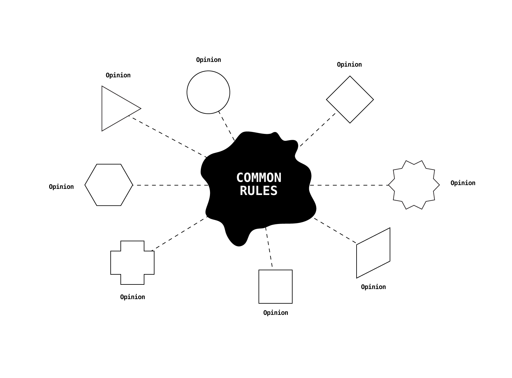
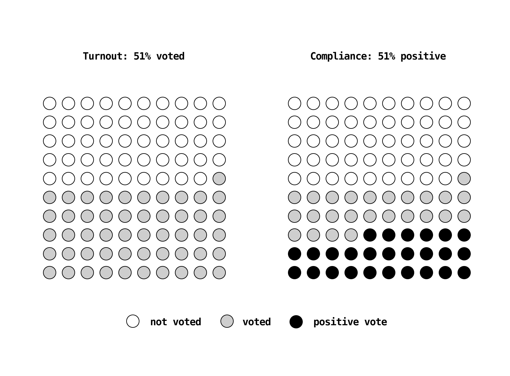

# Proof-of-opinion

The concept of voting system where each vote includes a unique `Opinion` defined by the voter. The concept is based on non-discussion and respect of any human point of view.

No more pre-defined conditions. Vote with you rules.

🖐🤞🖖🤘🙏🖕

### Opinion

`Opinion` is a basic object, it contains set of arguments, related to current voting. Unique voting has unique conditions of positive result and `Opinion` defines value types for these conditions. `Opinion` can contain any amount of arguments.

```javascript
// solidity

struct Opinion {
  address Voter;
  uint Condition_1;
  uint Condition_2;
  
  /* any amount of conditions */
}
```

Each `Opinion` changes common rules. Each voter defines value for each condition. Balancing functions calculate average values and return common values. Voting is not valid while all voting conditions do not reach common values.



## Simple example

For example `Voting` we define 2 conditions: `Turnout` and `Compliance`. These are the basic arguments used in any public voting. `Voting` is valid when both conditions are reached.

* `Turnout` is the required percent of users should vote
* `Compliance` is the percent of positive votes

Picture shows valid `Voting` with pre-defined `conditions = {turnout: 51%, compliance: 51%}`. In this case 26 of 100 users should vote positive.



With `Proof-of-opinion` protocol each `Voter` defines own values of conditions:

```javascript
// solidity

struct Opinion {
  address Voter;
  uint Turnout; /* 0-100 */ 
  uint Compliance; /* 0-100 */
}
```


`Voting` never has constant rules. They depend on whole community opinion, which is calculated by average functions after each `Vote`.

```javascript
// solidity

uint totalVoters; /* all users of voting system */
uint commonTurnout; /* average Turnout */
uint commonCompliance; /* average Compliance */

function checkStatus (address Voting) return (bool Status) {
  // getVotes() returns array of votes related to current voting
  uint totalVotes = getVotes(Voting).length;
  uint currentTurnout = totalVotes / totalVoters;

  // getPositive() returns array of positive votes related to current voting
  uint totalPositive = getPositive(Voting);
  uint currentCompliance = totalPositive / totalVotes;

  // check if conditions reached
  if (currentTurnout >= commonTurnout && currentCompliance >= commonCompliance) return true;

  // the $(commonCompliance) value may be calculated only among Opinions voted to current voting
}
```

## Epilogue

This method will be implemented in Book of Blockchain ([bit.church]), the community-build open-source history of Blockchain distributed into Ethereum network.

Each of 100 Verses is related to fact, event, concept or milestone. Book is built by common work of Blockchain enthusiasts. Anyone can apply new verse and create voting for replacement of one of the current verses.

## Contribute

For any contributions please contact via github or email null@bit.church. In name of Blockchain!